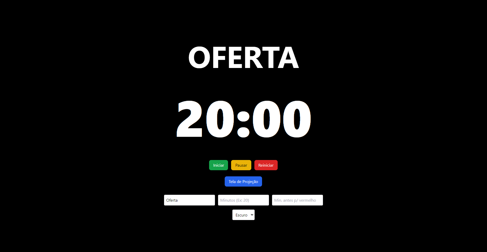
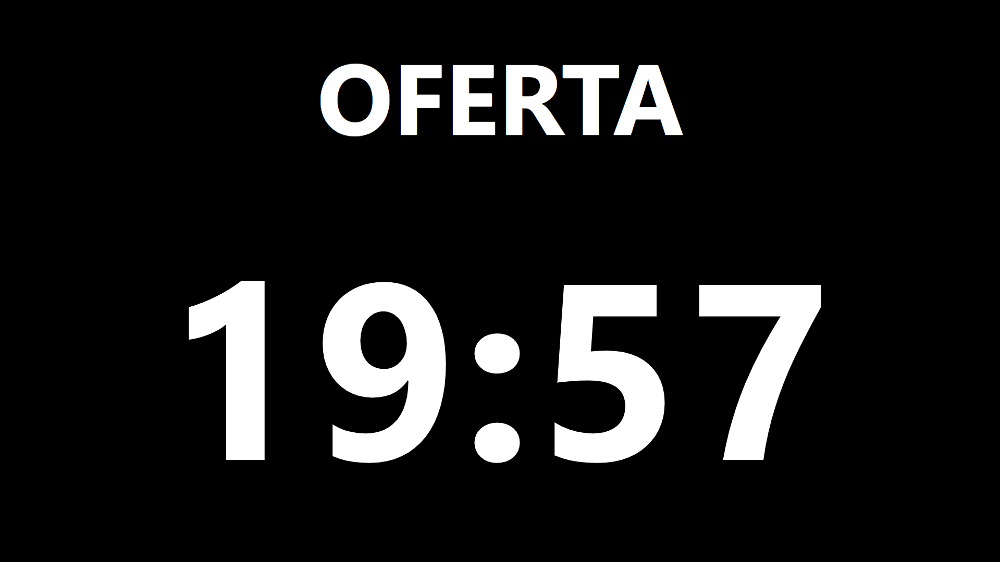

# Cronômetro da Igreja ⏱️

Aplicativo de cronômetro para igrejas, com suporte a **tela de projeção**, **tema claro/escuro** e integração desktop via **Electron**. Construído com **Vue 3**, **Vite** e **Pinia**.

---

## Descrição

O **Cronômetro da Igreja** é um aplicativo desktop voltado para gestão de tempo durante cultos, reuniões e apresentações, oferecendo:

- Cronômetro configurável com label personalizado
- Destaque visual quando o tempo está próximo de terminar
- Tela de projeção separada para segunda tela
- Suporte a tema claro/escuro, lembrando a última escolha do usuário
- Aplicativo desktop independente, sem necessidade de navegador

---

## Funcionalidades

- ✅ Criar cronômetro com nome e tempo definido
- ✅ Pausar, reiniciar e iniciar o cronômetro
- ✅ Destacar visualmente quando o tempo está próximo do fim
- ✅ Tela de projeção fullscreen para segunda tela
- ✅ Tema claro/escuro com preferência salva
- ✅ Build para Windows e macOS

---

## Screenshots

**Tela principal**  



**Tela de projeção**  



---

## Tecnologias utilizadas

- **Vue 3** – Frontend reativo
- **Vite** – Bundler rápido
- **Pinia** – Gerenciamento de estado
- **TailwindCSS** – Estilização
- **Electron** – Aplicativo desktop multiplataforma
- **Electron Builder** – Build para Windows/macOS

---

## Instalação e execução

### Requisitos
- Node.js >= 20
- npm ou yarn

### Rodando em desenvolvimento
# Instalar dependências
```powershell
npm install
```

# Rodar modo desenvolvimento
```powershell
npm run dev
```

# Build para produção
```powershell
npm run build
```
- Windows: dist/ com instalador NSIS (Cronômetro da Igreja-Setup-x.x.x.exe)
- macOS: dist/ com DMG ou ZIP (Cronômetro da Igreja x.x.x.dmg)

Após instalar, basta abrir o aplicativo e ele estará pronto para uso.

## Uso da Tela de Projeção
1. Abra o aplicativo principal
2. Clique em "Tela de Projeção"
3. A tela de projeção será exibida na segunda tela (ou na principal, se não houver segunda)
4. Pressione ESC para fechar a tela de projeção
5. Fechar o aplicativo principal também fecha a tela de projeção

## Personalização do Tema
- O aplicativo salva automaticamente o tema escolhido (claro/escuro)
- O tema é aplicado em tempo real na tela principal e de projeção

## Estrutura do Projeto
```bash
├─ electron/          # Código do Electron
├─ src/               # Código Vue 3
│  ├─ components/
│  ├─ router/
│  ├─ stores/
│  ├─ HomeView.vue
│  └─ ProjectorView.vue
├─ dist/              # Build de frontend
├─ build/             # Recursos do build (ícones, etc)
├─ package.json
└─ README.md
```

## Contribuição
1. Fork o projeto
2. Crie uma branch (git checkout -b feature/nome-da-feature)
3. Faça suas alterações
4. Commit (git commit -m 'Adicionei nova feature')
5. Push (git push origin feature/nome-da-feature)
6. Crie um Pull Request

## Licença
MIT License